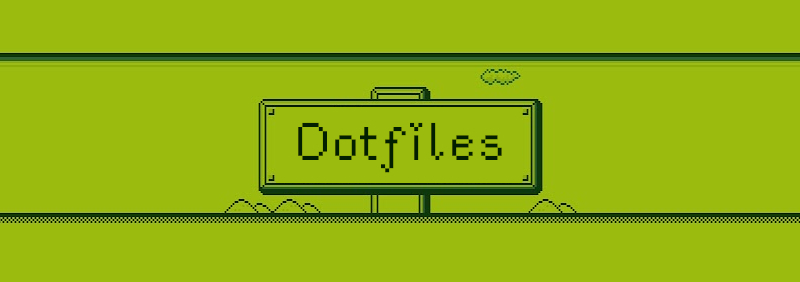

+ **[Firefox](https://github.com/furycd001/dots/tree/master/Firefox)**
+ **[Scripts](https://github.com/furycd001/dots/tree/master/Diva)**
+ **[Icons](https://github.com/furycd001/dots/tree/master/Icons)**
+ **[Conky](https://github.com/furycd001/dots/tree/master/conky)**
+ **[Gtk-3.0](https://github.com/furycd001/dots/tree/master/gtk-3.0)**
+ **[Ncmpcpp](https://github.com/furycd001/dots/tree/master/ncmpcpp)**
+ **[Waterfox (unmaintained)](https://github.com/furycd001/dots/tree/master/waterfox)**
+ **[xfce4-terminal](https://github.com/furycd001/dots/tree/master/xfce4-terminal)**
+ **[xfwm & xfce4-notifyd themes](https://github.com/furycd001/dots/tree/master/xfwm)**